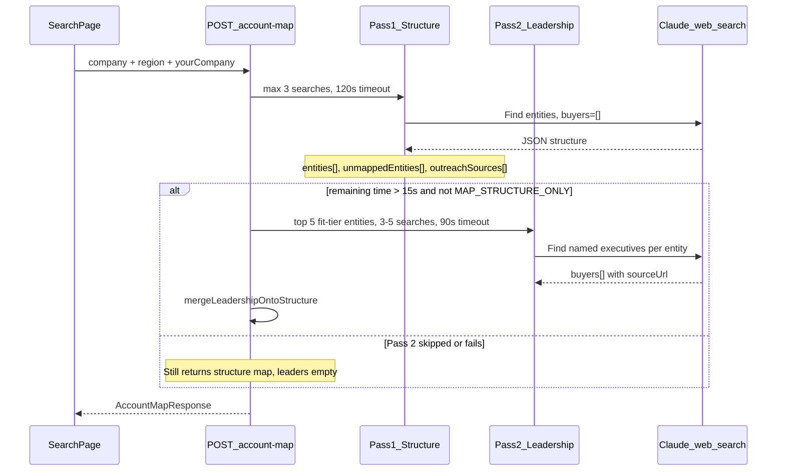
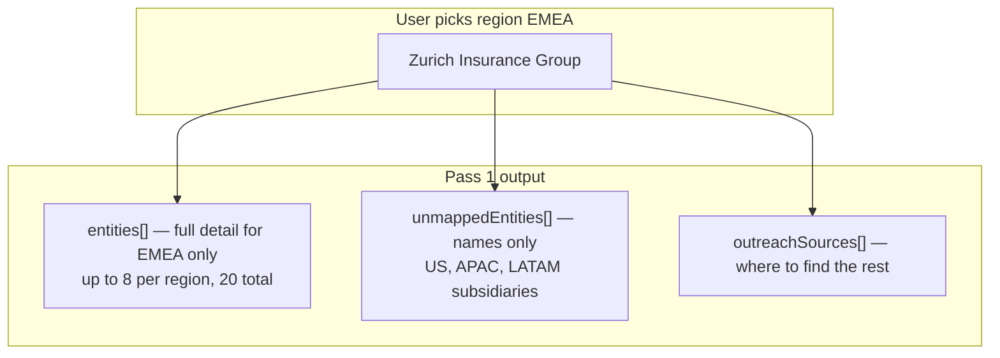
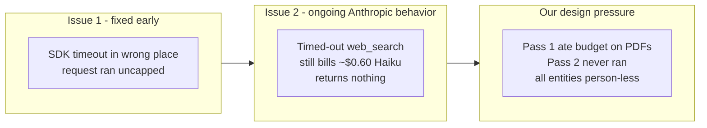
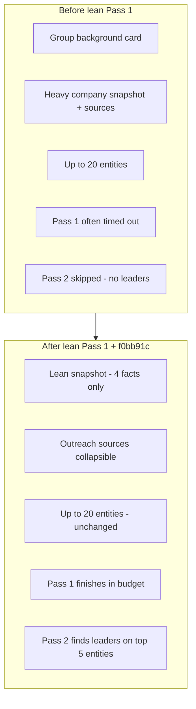

# Account Mapping — Recent Changes Explained

This document walks through how Mapping mode evolved on branch `fix/brief-normalize-opener`: why timeouts happened, how the two-pass architecture works, what was removed or added, and how to read results and logs on Replit.

For the durable architecture summary, see [architecture.md](./architecture.md#account-map-mapping-mode). For SDK cost/timeout bugs, see [anthropic-sdk-bug-report.md](./anthropic-sdk-bug-report.md).

---

## 1. What Mapping mode does (vs Brief)

| Mode | Purpose | Output |
|------|---------|--------|
| **Brief** | Deep research on **one company** | Snapshot, ICP score, buying committee, opener, talk track |
| **Mapping** | Enterprise **org chart** for federated groups | Up to 20 entities by region, fit tiers, named leaders on top entities, outreach pointers |

Mapping is for answers like: *"Zurich Insurance — which EMEA operating entities exist, which are worth pursuing, and who runs them?"*

Brief is for: *"Tell me everything about Zurich UK as a single account."*

---

## 2. The two-pass pipeline (core architecture)

Mapping was split because **one call tried to do too much** — discover subsidiaries *and* verify named executives from heavy regulator PDFs in a single budget.



**Pass 1 — Structure** (`artifacts/api-server/src/routes/account-map.ts`)

- Finds operating entities in the scoped region
- Every entity has `buyers: []` (no people yet)
- Returns lean `companySnapshot`, `outreachSources`, up to 20 entities

**Pass 2 — Leadership** (`artifacts/api-server/src/lib/account-map-merge.ts`)

- Picks **top 5** entities by fit tier (`strong` → `moderate` → `skip`)
- Runs ~1 focused search per entity (3–5 searches total)
- Hits regulator filings, SFCR PDFs, annual report exec pages — the slow sources
- Merges `buyers[]` back onto Pass 1 structure

**Important:** If Pass 2 times out, you **still get a map** — just without named leaders. Only Pass 1 failure (or client abort) produces a hard error.

---

## 3. Region scoping (why Zurich + EMEA)

Before region scoping, the model tried to map **the whole globe** in one run — too many searches for a 215s budget.



You pick **EMEA / APAC / North America / LATAM** in the UI. The prompt in `account-map.ts` (`REGION_SCOPES`) injects region-specific regulator hints (FINMA for CH, FCA for UK, etc.).

---

## 4. Why timeouts happened (the root cause)

Three layered problems:



Documented in [anthropic-sdk-bug-report.md](./anthropic-sdk-bug-report.md):

- **Issue 1:** Putting `timeout` in the request body was silently ignored → $7 runaway searches (fixed: timeout goes in SDK 2nd arg)
- **Issue 2:** Even with correct timeout, aborted searches still bill partial cost and return no JSON — worst case is pay-for-nothing
- **Design issue:** Pass 1 was doing leadership-grade work (group background, PDF deep-dives) before Pass 2 could run

---

## 5. Time budget (current numbers)

| Layer | Constant | Value | File |
|-------|----------|-------|------|
| Whole request | `MAPPING_TIMEOUT_MS` | 215s | `artifacts/api-server/src/routes/account-map.ts` |
| Pass 1 | `PASS_1_TIMEOUT_MS` / `PASS_1_MAX_SEARCHES` | 120s / 3 searches | same |
| Pass 2 | `PASS_2_TIMEOUT_MS` / searches | 90s / 3–5 searches | same |
| Client abort | `clientTimeout` | 225s | `artifacts/gtm-intel/src/pages/account-brief.tsx` |
| Pass 2 gate | `PASS_2_MIN_REMAINING_MS` | 15s left after Pass 1 | same |

A successful Zurich run means Pass 1 finished **under 120s**, leaving enough room for Pass 2 (or Pass 2 was skipped but structure returned).

---

## 6. Recent commits — what changed and why

### Phase A: Cost safeguards (commits `154768c`, `9dbc762`)

- `maxRetries: 0` — no triple-billing on failure
- `web_search` `max_uses` cap per pass
- SDK `timeout` moved to RequestOptions (2nd argument)
- `MAP_STRUCTURE_ONLY=1` env flag for cheap smoke tests

### Phase B: Two-pass split (`56bf9a0` → `6187bcc`)

- Pass 1 = structure only; Pass 2 = leadership only
- Region picker (EMEA / APAC / NA / LATAM)
- Leadership enrich cap = 5 entities

### Phase C: Lean Pass 1 (`8987f2b`) — the big schema/UI change

**Removed from Mapping entirely:**

| Removed | Why | Where deeper context lives now |
|---------|-----|-------------------------------|
| `groupBackground` ("Their world" card) | Search-hungry; duplicated Brief value | Brief mode |
| Heavy `companySnapshot` fields | Snapshot searches burned Pass 1 budget | Brief mode |
| Pass 1 search cap 4 → **3** | Finish faster, leave room for Pass 2 | — |
| Pass 2 timeout 60s → **90s** | Leadership PDF searches need time | — |

**Kept:**

- Up to **20 entities** (8 per region bucket)
- `unmappedEntities[]` overflow names
- `outreachSources[]` — pointers to find the rest

UI change: `map-background-section.tsx` now shows **"Outreach sources"** only (no "Their world" card).

OpenAPI + generated types updated via `lib/api-spec/openapi.yaml` — `MapGroupBackground` schema deleted.

### Phase D: Pass 1 search discipline (`f0bb91c`)

**Problem:** Pass 1 was still opening FINMA/SFCR PDFs — work that belongs in Pass 2 — and blowing the 120s deadline.

**Changes:**

| Change | Effect |
|--------|--------|
| `structurePackExcerpt()` | Strips leadership title aliases from Pass 1 prompt |
| `PASS_1_SEARCH_RULES` | Explicit ban on PDFs, SFCR, regulator exports in Pass 1 |
| Sector pack header | Pass 1 = sections 3+7 (subsidiaries); Pass 2 = sections 2+3+6 (leaders) |
| Structure format rules | No extra searches for `outreachSources` or per-entity news |
| Per-pass timing logs | `[account-map] Pass 1 complete in Xms` in Replit Console |
| Pass-specific error messages | "Pass 1 (structure) timed out" vs "Pass 2 (leadership) timed out" |

---

## 7. Before vs after (what you see on screen)



**Successful Zurich EMEA map should show:**

- Entity grid with EMEA subsidiaries (Zurich UK, Zurich Germany, etc.)
- Collapsed section with other-region names + outreach source links
- Named buyers with `sourceUrl` on 2–5 top-fit entities (if Pass 2 completed)
- No "Their world" / group background block

---

## 8. Environment knobs (Replit Secrets)

| Secret | Purpose |
|--------|---------|
| `MAPPING_MODEL=claude-haiku-4-5-20251001` | Cheaper/faster while tuning (Pass 1 + Pass 2) |
| `MAPPING_PASS_2_MODEL=claude-sonnet-4-6` | Optional: Haiku structure + Sonnet leaders |
| `MAP_STRUCTURE_ONLY=1` | Skip Pass 2 entirely — cheapest smoke test |

**Verify after restart** — in Replit Console (not Shell), look for:

```
[account-map] runtime config {"pass1Model":"...","pass1":{"maxSearches":3},...,"pass2":{"timeoutMs":90000},...}
```

During a run:

```
Account map pass 1 starting
[account-map] Pass 1 (structure) complete in 87000ms
Account map pass 2 starting
[account-map] Pass 2 (leadership) complete in 62000ms
Account map complete elapsedMs: 152000 entityCount: 14
```

---

## 9. Error messages decoded

| UI message | Meaning | Next step |
|------------|---------|-----------|
| **Pass 1 (structure) timed out** | 120s deadline hit during entity discovery | Retry; try `MAP_STRUCTURE_ONLY=1` to isolate |
| **Mapping took too long and was stopped** | Client abort at 225s | Both passes ran too slow — check Console timing |
| Map returns but **empty buyers everywhere** | Pass 2 failed/skipped; structure OK | Normal partial result — Pass 1 succeeded |

---

## 10. Key files reference

| Concern | File |
|---------|------|
| Orchestration + timeouts | `artifacts/api-server/src/routes/account-map.ts` |
| Pass 1 JSON shape + rules | `artifacts/api-server/src/prompts/account-map-structure-format.ts` |
| Pass 2 JSON shape + rules | `artifacts/api-server/src/prompts/account-map-people-format.ts` |
| Sector pack (EU financial) | `artifacts/api-server/src/packs/european-financial-services.md` |
| Leader selection + merge | `artifacts/api-server/src/lib/account-map-merge.ts` |
| Response normalization | `artifacts/api-server/src/lib/account-map-normalize.ts` |
| Client timeout | `artifacts/gtm-intel/src/pages/account-brief.tsx` |
| Architecture doc | `docs/architecture.md` |
| SDK cost bugs | `docs/anthropic-sdk-bug-report.md` |

---

## Summary

Mapping now splits **"find the org chart"** (Pass 1, fast, 3 broad searches) from **"find named leaders"** (Pass 2, slow, regulator PDFs), scopes work to one region at a time, dropped search-hungry group background, and extended Pass 2 to 90s — so enterprises like Zurich can return a usable map inside ~3.5 minutes instead of timing out with nothing.
